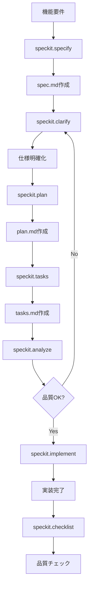

# Speckit を用いた仕様駆動開発ガイド

このプロジェクトでは、[Speckit](https://github.com/specifyapp/speckit) のプロンプトとスクリプトを使ってフィーチャー計画を管理します。GitHub Copilot を主エージェントとして利用するため、Copilot 向け指示ファイルを常に最新化することがワークフローの一部です。

## 🚀 クイックスタートガイド

新しいフィーチャーを開発する際の基本的な流れ：

### 0. 開発環境の準備（初回のみ）

**Serena MCP の起動確認**

このプロジェクトでは、高度なコード解析とシンボル単位の編集に **Serena MCP** を使用します。

1. VS Code のステータスバー（左下）で MCP サーバーの状態を確認
2. Serena が起動していない場合：
   - コマンドパレット（`Cmd+Shift+P` / `Ctrl+Shift+P`）を開く
   - `MCP: Restart Server` を検索して実行
   - `serena` を選択

⚠️ **Serena MCP が起動していないと、以下の機能が使えません：**
- シンボル単位でのコード検索・編集
- リファクタリング（リネーム、シンボル置換）
- 高度なコード解析

✅ **メモリファイル（`.serena/memories/`）は永続化されているため、基本的なプロジェクト理解は起動なしでも可能です。**

### 1. フィーチャーブランチの作成
```bash
git checkout -b 001-your-feature-name
```
※ 先頭3桁の番号は必須です

### 2. 計画ファイルの準備
```bash
.specify/scripts/bash/setup-plan.sh --json
```
生成される `specs/001-your-feature-name/plan.md` に実装計画を記入

### 3. GitHub Copilot で仕様を作成
```
/speckit.specify ユーザー認証機能を追加したい...
```
`spec.md` が生成されます

### 4. 設計成果物を整備
- `data-model.md`: データモデル定義
- `contracts/`: API契約
- `quickstart.md`: 動作確認手順

### 5. Copilot のコンテキストを更新
```bash
.specify/scripts/bash/update-agent-context.sh copilot
```

### 6. タスクリストを生成
```
/speckit.tasks
```
`tasks.md` が生成されます

### 7. 実装を開始
```
/speckit.implement
```
タスクに従って実装が進みます

---

## 📚 目次

- [テンプレート使用時の事前準備](#テンプレート使用時の事前準備)
- [プロジェクト構造](#プロジェクト構造)
- [前提条件](#前提条件)
- [フェーズ 0: 計画の雛形作成と調査](#フェーズ-0-計画の雛形作成と調査)
- [フェーズ 1: 設計成果物と Copilot 連携](#フェーズ-1-設計成果物と-copilot-連携)
- [フェーズ 2: タスク生成](#フェーズ-2-タスク生成)
- [Speckit プロンプトの使い方](#speckit-プロンプトの使い方)
- [フェーズ 3: 実装とテスト](#フェーズ-3-実装とテスト)
- [トラブルシューティング](#トラブルシューティング)
- [ワークフローの再実行](#ワークフローの再実行)
- [ガバナンス状況](#ガバナンス状況)

---

## テンプレート使用時の事前準備
- プロジェクト内で`volunty`と検索し、本来のアプリ名に置き換える

## プロジェクト構造

```
.
├── .github/
│   ├── copilot-instructions.md      # GitHub Copilot の指示ファイル（自動生成）
│   ├── prompts/                     # Speckit プロンプト（8種類）
│   ├── knowledge-base/              # プロジェクトナレッジベース
│   └── workflows/                   # CI/CD ワークフロー
├── .specify/
│   ├── scripts/bash/                # Speckit Bash スクリプト群
│   │   ├── check-prerequisites.sh   # 環境チェック
│   │   ├── setup-plan.sh           # 計画雛形作成
│   │   ├── update-agent-context.sh # Copilot 指示ファイル更新
│   │   └── create-new-feature.sh   # 新規フィーチャー作成
│   ├── templates/                   # ドキュメントテンプレート
│   └── memory/
│       └── constitution.md          # プロジェクト憲章
├── specs/                           # フィーチャー仕様ディレクトリ
│   └── NNN-feature-name/           # 各フィーチャーのドキュメント
│       ├── spec.md                 # 機能仕様
│       ├── plan.md                 # 実装計画
│       ├── research.md             # 調査・決定事項
│       ├── data-model.md           # データモデル
│       ├── tasks.md                # タスクリスト
│       ├── notes.md                # 実装メモ
│       ├── quickstart.md           # クイックスタート
│       └── contracts/              # API契約
├── docs/                            # プロジェクトドキュメント
└── README.md                        # このファイル
```

## 前提条件

- Git ブランチ名は `NNN-feature-name`（例: `001-new-feature`）とし、Speckit スクリプトの接頭辞チェックを通過させる。
- `.specify/scripts/bash/*.sh` を実行できる Bash 互換環境（macOS / Linux / WSL）を用意する。
- `.specify` ディレクトリをリポジトリに含めておく。
- 任意: GitHub Copilot を有効にし、生成される `.github/copilot-instructions.md` をエディタで読み込ませる。
- 事前確認: `.specify/scripts/bash/check-prerequisites.sh --json` をリポジトリルートで実行し、スクリプト群と必要ディレクトリが認識されるかを確認する。

## フェーズ 0: 計画の雛形作成と調査

1. **フィーチャーブランチの作成／切り替え**
   ```bash
   git checkout -b 001-your-feature
   ```
   - 先頭 3 桁の番号は必須。番号なしで実行すると `ERROR: Not on a feature branch` が出力される。
   - 既存ブランチを流用する場合も `git checkout 00X-...` の形式に揃える。

2. **環境チェック**
   ```bash
   .specify/scripts/bash/check-prerequisites.sh --json
   ```
   - `FEATURE_DIR` と `AVAILABLE_DOCS` が表示されれば準備完了。
   - 欠損があれば `.specify/` 配下の権限やブランチ名を再確認する。

3. **計画用ファイルの生成**
   ```bash
   .specify/scripts/bash/setup-plan.sh --json
   ```
   出力される JSON から次の値を控える:
   - `FEATURE_SPEC`: フィーチャー仕様の雛形
   - `IMPL_PLAN`: 実装計画 (`plan.md`)
   - `SPECS_DIR`: 当該フィーチャーの成果物ディレクトリ

2. **`plan.md` の記入**（`IMPL_PLAN` で示されたパス）
   - フィーチャー概要と技術コンテキストを整理し、未確定事項は `NEEDS CLARIFICATION` と明記する。
   - プロジェクト構造や憲章に関する不明点も記録する。
   - 対象ファイル: `specs/<feature>/plan.md` （例: `specs/001-speckit-template-doc/plan.md`）。
   - または GitHub Copilot Chat で `/speckit.plan` を実行して自動生成することもできる。

5. **`research.md` で不明点を解消**
   `specs/<feature>/research.md` に Decision / Rationale / Alternatives を記載し、`NEEDS CLARIFICATION` がなくなるまで更新する。
   - 対象ファイル: `specs/<feature>/research.md` （例: `specs/001-speckit-template-doc/research.md`）。

## フェーズ 1: 設計成果物と Copilot 連携

1. **設計成果物の整備**（`specs/<feature>/` 配下）
   - `data-model.md`: エンティティ、関係、バリデーションルール。
   - `contracts/`: REST・OpenAPI・GraphQL 変更、または「変更なし」の記録。
   - `quickstart.md`: 今後のコントリビューター向けチェックリスト。

   | ファイル                        | 目的                       | 検証観点                                     |
   | ------------------------------- | -------------------------- | -------------------------------------------- |
   | `specs/<feature>/data-model.md` | 用語とエンティティの整理   | エンティティと README 用語が一致しているか   |
   | `specs/<feature>/contracts/`    | API 変更有無の明示         | 契約ファイルに「変更なし」が記載されているか |
   | `specs/<feature>/quickstart.md` | コントリビューター向け手順 | README の手順と矛盾がないか                  |

2. **GitHub Copilot のコンテキスト更新**
   ```bash
   .specify/scripts/bash/update-agent-context.sh copilot
   ```
   - `plan.md` を解析し `.github/copilot-instructions.md` を更新する。
   - 手動で追記したメモは `<!-- MANUAL ADDITIONS START/END -->` の間に残る。
   - 実行後は `.github/copilot-instructions.md` を開き、`Active Technologies` と `Recent Changes` に最新ブランチ名が反映されているか確認する。
   - この更新により、Copilot プロンプト（`/speckit.*`）が最新のプロジェクトコンテキストを参照できるようになる。

3. **Constitution Check の再確認**
   - `.specify/memory/constitution.md` は現在プレースホルダーのみ。`plan.md` や README でゲートが情報提供目的である旨を明記する。

## フェーズ 2: タスク生成

1. **実装タスクの生成**
   
   GitHub Copilot Chat で `/speckit.tasks` プロンプトを実行します：
   
   ```
   /speckit.tasks
   ```
   
   このプロンプトは以下を実行します：
   - `.specify/scripts/bash/check-prerequisites.sh --json` で環境情報を取得
   - `specs/<feature>/` 配下の成果物（`plan.md`, `spec.md`, `data-model.md` など）を読み込み
   - ユーザーストーリーごとに整理されたタスクリストを生成
   - `specs/<feature>/tasks.md` として出力
   
   成果物を更新した際は、このプロンプトを再度実行してタスクを同期してください。

2. **Copilot とタスクを突き合わせる**
   - `.github/copilot-instructions.md` を確認し、最新のスタック／コンテキストを反映できているかチェックする。
   - タスク編集後に必要であれば Copilot 指示ファイルを再生成する。

## Speckit プロンプトの使い方

このプロジェクトには GitHub Copilot で使用できる8つの専用プロンプトが用意されています。各プロンプトは特定の開発フェーズで使用し、仕様駆動開発のワークフローを支援します。

### 基本的な使用方法

GitHub Copilot Chat で `/` を入力すると、以下のプロンプトが利用できます。これらのプロンプトは `.specify/scripts/bash/` 配下のスクリプトと連携し、成果物の生成・管理を自動化します。

#### 1. `/speckit.specify` - 機能仕様の作成・更新
- **用途**: 自然言語の機能記述から機能仕様を作成または更新
- **使用タイミング**: フィーチャー開発の初期段階
- **入力**: 機能の概要や要件を自然言語で記述
- **出力**: 構造化された機能仕様書（`spec.md`）

```
/speckit.specify ユーザー認証機能を追加したい。メールアドレスとパスワードでログインでき、JWT トークンを発行する機能
```

#### 2. `/speckit.clarify` - 仕様の明確化
- **用途**: 機能仕様の不十分な部分を特定し、最大5つの明確化質問を実施
- **使用タイミング**: 仕様作成後、プランニング前
- **入力**: 既存の機能仕様
- **出力**: 明確化された仕様書

```
/speckit.clarify 現在の認証機能仕様について、曖昧な部分を明確にしたい
```

#### 3. `/speckit.plan` - 実装計画の作成
- **用途**: 設計成果物を生成するための実装計画ワークフロー実行
- **使用タイミング**: 仕様確定後
- **入力**: 確定した機能仕様
- **出力**: 実装計画書（`plan.md`）

```
/speckit.plan 認証機能の実装計画を作成して
```

#### 4. `/speckit.tasks` - タスクリストの生成
- **用途**: 実行可能で依存関係順序付きのタスクリスト生成
- **使用タイミング**: 実装計画確定後
- **入力**: 設計成果物（plan.md、spec.md等）
- **出力**: タスクリスト（`tasks.md`）
- **内部動作**: `check-prerequisites.sh` を実行して環境情報を取得し、各成果物を読み込んでタスクを生成

```
/speckit.tasks 認証機能の実装タスクを生成して
```

#### 5. `/speckit.checklist` - カスタムチェックリスト生成
- **用途**: 機能要件に基づく品質チェックリスト作成
- **使用タイミング**: 実装中や完了後の品質確認時
- **入力**: ユーザー要件
- **出力**: カスタムチェックリスト

```
/speckit.checklist 認証機能のセキュリティチェックリストを作成して
```

#### 6. `/speckit.implement` - 実装実行
- **用途**: tasks.mdで定義されたタスクの処理・実行
- **使用タイミング**: 実装フェーズ
- **入力**: 完成したタスクリスト
- **出力**: 実装されたコード

```
/speckit.implement 認証機能のタスクを実行して
```

#### 7. `/speckit.analyze` - 品質分析
- **用途**: spec.md、plan.md、tasks.mdの一貫性と品質分析
- **使用タイミング**: タスク生成後、実装前
- **入力**: 各種成果物
- **出力**: 分析レポートと改善提案

```
/speckit.analyze 現在の成果物の一貫性をチェックして
```

#### 8. `/speckit.constitution` - プロジェクト憲章管理
- **用途**: プロジェクト憲章の作成・更新と依存テンプレートの同期
- **使用タイミング**: プロジェクト初期設定や方針変更時
- **入力**: プロジェクトの原則や方針
- **出力**: 更新されたプロジェクト憲章

```
/speckit.constitution プロジェクトの開発方針を更新して
```
## フェーズ 3: 実装とテスト

1. **実装の開始**
   - `specs/<feature>/tasks.md` のタスクリストに従って実装を進める。
   - GitHub Copilot の指示ファイル（`.github/copilot-instructions.md`）が最新であることを確認し、コンテキストを共有する。
   - 実装中に設計変更が必要な場合は `specs/<feature>/notes.md` に記録し、必要に応じて関連ファイルを更新する。

2. **進捗管理とドキュメント更新**
   ```bash
   # 実装進捗をノートに記録
   echo "## Implementation Notes - $(date)" >> specs/<feature>/notes.md
   ```
   - 各タスク完了時に `tasks.md` にチェックマークを付け、課題や変更点は `notes.md` に追記する。
   - API 変更が発生した場合は `specs/<feature>/contracts/` 配下のファイルを更新する。
   - データモデル変更があれば `specs/<feature>/data-model.md` を同期する。

3. **テストとレビュー準備**
   ```bash
   # Copilot 指示ファイルを最新化（設計変更があった場合）
   .specify/scripts/bash/update-agent-context.sh copilot
   
   # クイックスタートガイドの検証
   .specify/scripts/bash/check-prerequisites.sh --json
   ```
   - `specs/<feature>/quickstart.md` の手順が実装と一致しているかを確認する。
   - テスト実行と動作確認を行い、結果を `notes.md` に記録する。
   - レビュー前に全ての成果物（`spec.md`, `data-model.md`, `contracts/`, `quickstart.md`, `tasks.md`）の整合性をチェックする。

4. **実装完了チェックリスト**
   - [ ] `tasks.md` の全タスクが完了している
   - [ ] `quickstart.md` の手順で正常に動作する
   - [ ] 設計変更がある場合、関連する成果物が全て更新されている
   - [ ] `.github/copilot-instructions.md` が最新の実装を反映している
   - [ ] テストが通過し、動作確認済みである
   - [ ] `notes.md` に実装時の重要な判断や課題が記録されている

### プロンプト使用時のワークフロー例



### 注意事項

- プロンプトは順序立てて使用することを推奨します（specify → clarify → plan → tasks → implement）
- 各プロンプトの出力は次のフェーズの入力として使用されます  
- 仕様変更時は影響を受けるプロンプトを順次再実行してください
- すべての成果物は日本語で生成されます
- プロンプトは内部で `.specify/scripts/bash/` のスクリプトを自動実行します

### プロンプトとスクリプトの関係

| プロンプト              | 内部で使用されるスクリプト | 生成される成果物          |
| ----------------------- | -------------------------- | ------------------------- |
| `/speckit.specify`      | -                          | `spec.md`                 |
| `/speckit.clarify`      | -                          | `spec.md` (更新)          |
| `/speckit.plan`         | -                          | `plan.md`                 |
| `/speckit.tasks`        | `check-prerequisites.sh`   | `tasks.md`                |
| `/speckit.implement`    | -                          | 実装コード                |
| `/speckit.analyze`      | -                          | 分析レポート              |
| `/speckit.checklist`    | -                          | チェックリスト            |
| `/speckit.constitution` | -                          | `constitution.md`         |
| (手動実行)              | `setup-plan.sh`            | テンプレート雛形          |
| (手動実行)              | `update-agent-context.sh`  | `copilot-instructions.md` |
| (手動実行)              | `create-new-feature.sh`    | 新規フィーチャー構造      |


## トラブルシューティング

| 症状                               | 原因                                                                      | 対処                                                                                                   |
| ---------------------------------- | ------------------------------------------------------------------------- | ------------------------------------------------------------------------------------------------------ |
| `ERROR: Not on a feature branch`   | ブランチ名が `NNN-` 接頭辞に準拠していない                                | `git checkout -b 00X-...` でブランチを作り直し、`setup-plan.sh` を再実行する                           |
| Plan テンプレートが見つからない    | `.specify/templates/plan-template.md` が欠損または権限不足                | テンプレートを復元し、必要なら `chmod +x` でスクリプト権限を付与してから再試行                         |
| Copilot 指示ファイルが更新されない | `plan.md` 未保存または `.github/copilot-instructions.md` への書き込み不可 | `plan.md` を保存し、`update-agent-context.sh copilot` を再実行。必要に応じて `chmod` や Git 属性を確認 |
| `tasks.md` が古いまま              | Speckit タスク生成を再実行していない                                      | 最新の成果物保存後に GitHub Copilot Chat で `/speckit.tasks` を再実行し、差分を確認                    |

## ワークフローの再実行

- フィーチャーを切り替える際は `.specify/scripts/bash/setup-plan.sh --json` を再実行してパスを確認し、`notes.md` 等にアップデートを追記する。
- `plan.md` や `research.md` を更新したら、必ず `.specify/scripts/bash/update-agent-context.sh copilot` を再度実行し、Copilot へ最新情報を供給する。
- `data-model.md` / `contracts/` / `quickstart.md` を改訂した場合、GitHub Copilot Chat で `/speckit.tasks` を再実行してタスクとの整合性を維持する。
- 実装前レビューでは `tasks.md` と README の手順が一致しているかを突き合わせ、差異があれば再生成を行う。

## ガバナンス状況

プロジェクトの憲章（`.specify/memory/constitution.md`）は現在プレースホルダーです。内容が整備されるまでは、計画内の Constitution Check セクションを情報提供目的として扱い、必要な方針は成果物側に直接記載してください。
# spec_driven_template
