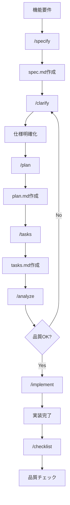

## 📚 目次

- [仕様駆動開発ガイド](#仕様駆動開発ガイド)
  - [🚀 クイックスタートガイド](#-クイックスタートガイド)
    - [0. 開発環境の準備（初回のみ）](#0-開発環境の準備初回のみ)
    - [1. GitHub Copilot で仕様を作成](#1-github-copilot-で仕様を作成)
    - [2. 実装計画と設計成果物を生成](#2-実装計画と設計成果物を生成)
    - [3. Copilot のコンテキストを更新](#3-copilot-のコンテキストを更新)
    - [4. タスクリストを生成](#4-タスクリストを生成)
    - [5. 実装を開始](#5-実装を開始)
  - [テンプレート使用時の事前準備](#テンプレート使用時の事前準備)
  - [プロジェクト構造](#プロジェクト構造)
  - [前提条件](#前提条件)
  - [フェーズ 0: 計画の雛形作成と調査](#フェーズ-0-計画の雛形作成と調査)
  - [フェーズ 1: 設計成果物と Copilot 連携](#フェーズ-1-設計成果物と-copilot-連携)
  - [フェーズ 2: タスク生成](#フェーズ-2-タスク生成)
  - [フェーズ 3: 実装とテスト](#フェーズ-3-実装とテスト)
  - [ワークフロー例](#ワークフロー例)
    - [注意事項](#注意事項)
  - [プロンプトとスクリプトの関係](#プロンプトとスクリプトの関係)
  - [プロンプトの使い方](#プロンプトの使い方)
    - [基本的な使用方法](#基本的な使用方法)
      - [1. `/specify` - 機能仕様の作成・更新](#1-specify---機能仕様の作成更新)
      - [2. `/clarify` - 仕様の明確化](#2-clarify---仕様の明確化)
      - [3. `/plan` - 実装計画の作成](#3-plan---実装計画の作成)
      - [4. `/tasks` - タスクリストの生成](#4-tasks---タスクリストの生成)
      - [5. `/checklist` - カスタムチェックリスト生成](#5-checklist---カスタムチェックリスト生成)
      - [6. `/implement` - 実装実行](#6-implement---実装実行)
      - [7. `/analyze` - 品質分析](#7-analyze---品質分析)
      - [8. `/constitution` - プロジェクト憲章管理](#8-constitution---プロジェクト憲章管理)
  - [トラブルシューティング](#トラブルシューティング)
  - [ワークフローの再実行](#ワークフローの再実行)
    - [`plan.md` 修正後のワークフロー](#planmd-修正後のワークフロー)
    - [その他の再実行パターン](#その他の再実行パターン)

---

# 仕様駆動開発ガイド

このプロジェクトではプロンプトとスクリプトを使ってフィーチャー計画を管理します。GitHub Copilot を主エージェントとして利用するため、Copilot 向け指示ファイルを常に最新化することがワークフローの一部です。

## 🚀 クイックスタートガイド

新しいフィーチャーを開発する際の基本的な流れ：

### 0. 開発環境の準備（初回のみ）

**Serena MCP の起動確認**

このプロジェクトでは、高度なコード解析とシンボル単位の編集に **Serena MCP** を使用します。

1. VS Code のステータスバー（左下）で MCP サーバーの状態を確認
2. Serena が起動していない場合：
   - コマンドパレット（`Cmd+Shift+P` / `Ctrl+Shift+P`）を開く
   - `MCP: Restart Server` を検索して実行
   - `serena` を選択

⚠️ **Serena MCP が起動していないと、高度なコード解析が使えません：**
✅ **メモリファイル（`.serena/memories/`）は永続化されているため、基本的なプロジェクト理解は起動なしでも可能です。**

### 1. GitHub Copilot で仕様を作成
```
/specify ユーザー認証機能を追加したい...
```
- フィーチャーブランチが自動的に作成されます（形式: `NNN-feature-name`）
- `spec.md` が生成されます

### 2. 実装計画と設計成果物を生成
```
/plan
```
- `plan.md`（実装計画）が生成されます
- 対話形式で以下の設計成果物も生成されます：
  - `data-model.md`: データモデル定義
  - `contracts/`: API契約
  - `quickstart.md`: 動作確認手順

### 3. Copilot のコンテキストを更新
```bash
.specify/scripts/bash/update-agent-context.sh copilot
```

### 4. タスクリストを生成
```
/tasks
```
`tasks.md` が生成されます

### 5. 実装を開始
```
/implement
```
タスクに従って実装が進みます

## テンプレート使用時の事前準備
- プロジェクト内で`{app name}`と検索し、本来のアプリ名に置き換える

## プロジェクト構造

```
.
├── .github/
│   ├── copilot-instructions.md      # GitHub Copilot の指示ファイル（自動生成）
│   ├── prompts/                     # プロンプト（8種類）
│   ├── knowledge-base/              # プロジェクトナレッジベース
│   └── workflows/                   # CI/CD ワークフロー
├── .specify/
│   ├── scripts/bash/                # Bash スクリプト群
│   │   ├── check-prerequisites.sh   # 環境チェック
│   │   ├── setup-plan.sh           # 計画雛形作成
│   │   ├── update-agent-context.sh # Copilot 指示ファイル更新
│   │   └── create-new-feature.sh   # 新規フィーチャー作成
│   ├── templates/                   # ドキュメントテンプレート
│   └── memory/
│       └── constitution.md          # プロジェクト憲章
├── specs/                           # フィーチャー仕様ディレクトリ
│   └── NNN-feature-name/           # 各フィーチャーのドキュメント
│       ├── spec.md                 # 機能仕様
│       ├── plan.md                 # 実装計画
│       ├── research.md             # 調査・決定事項
│       ├── data-model.md           # データモデル
│       ├── tasks.md                # タスクリスト
│       ├── notes.md                # 実装メモ
│       ├── quickstart.md           # クイックスタート
│       └── contracts/              # API契約
├── docs/                            # プロジェクトドキュメント
└── README.md                        # このファイル
```

## 前提条件

- Git ブランチ名は `NNN-feature-name`（例: `001-new-feature`）とし、スクリプトの接頭辞チェックを通過させる。
- `.specify/scripts/bash/*.sh` を実行できる Bash 互換環境（macOS / Linux / WSL）を用意する。
- 事前確認: `.specify/scripts/bash/check-prerequisites.sh --json` をリポジトリルートで実行し、スクリプト群と必要ディレクトリが認識されるかを確認する。

## フェーズ 0: 計画の雛形作成と調査

1. **GitHub Copilot で仕様を作成**
   ```
   /specify ユーザー認証機能を追加したい...
   ```
   - フィーチャーブランチが自動的に作成されます（形式: `NNN-feature-name`）
   - `spec.md` と `plan.md` の雛形が生成されます
   - 先頭 3 桁の番号は自動で採番されます

2. **環境チェック**
   ```bash
   .specify/scripts/bash/check-prerequisites.sh --json
   ```
   - `FEATURE_DIR` と `AVAILABLE_DOCS` が表示されれば準備完了。
   - 欠損があれば `.specify/` 配下の権限やブランチ名を再確認する。

3. **`plan.md` のレビューと修正**
   
   `/specify` で生成された `plan.md` を確認し、必要に応じて修正します：
   
   **a) 直接編集による修正**
   - `specs/<feature>/plan.md` を開いて直接編集
   - フィーチャー概要、技術コンテキスト、未確定事項を整理
   - 未確定事項は `NEEDS CLARIFICATION` と明記
   
   **b) Copilot を使った対話的な修正**
   ```
   plan.mdの認証方式について、JWT だけでなく OAuth2.0 も検討すべきでは？
   ```
   - Copilot に修正案や追加検討事項を提案してもらえます
   - `/plan` を再実行して計画を更新することも可能
   
   **c) `/clarify` で曖昧な部分を明確化**
   ```
   /clarify
   ```
   - 仕様の不十分な部分を特定し、最大5つの質問で明確化
   - 回答を元に `spec.md` と `plan.md` が更新されます

4. **`research.md` で不明点を解消**
   `specs/<feature>/research.md` に Decision / Rationale / Alternatives を記載し、`NEEDS CLARIFICATION` がなくなるまで更新する。
   - 対象ファイル: `specs/<feature>/research.md` （例: `specs/001-template-doc/research.md`）。

## フェーズ 1: 設計成果物と Copilot 連携

1. **設計成果物の生成**（`specs/<feature>/` 配下）
   
   `/plan` プロンプトを実行すると、対話形式で以下の設計成果物が生成されます：
   
   ```
   /plan
   ```
   
   生成される成果物：
   - `plan.md`: 実装計画書
   - `data-model.md`: エンティティ、関係、バリデーションルール
   - `contracts/`: REST・OpenAPI・GraphQL 契約、または「変更なし」の記録
   - `quickstart.md`: コントリビューター向けチェックリスト
   
   **手動で作成する場合：**
   
   | ファイル                        | 目的                       | 検証観点                                     |
   | ------------------------------- | -------------------------- | -------------------------------------------- |
   | `specs/<feature>/data-model.md` | 用語とエンティティの整理   | エンティティと README 用語が一致しているか   |
   | `specs/<feature>/contracts/`    | API 変更有無の明示         | 契約ファイルに「変更なし」が記載されているか |
   | `specs/<feature>/quickstart.md` | コントリビューター向け手順 | README の手順と矛盾がないか                  |

2. **GitHub Copilot のコンテキスト更新**
   ```bash
   .specify/scripts/bash/update-agent-context.sh copilot
   ```
   - `plan.md` を解析し `.github/copilot-instructions.md` を更新する。
   - 手動で追記したメモは `<!-- MANUAL ADDITIONS START/END -->` の間に残る。
   - 実行後は `.github/copilot-instructions.md` を開き、`Active Technologies` と `Recent Changes` に最新ブランチ名が反映されているか確認する。
   - この更新により、Copilot プロンプトが最新のプロジェクトコンテキストを参照できるようになる。

3. **Constitution Check の再確認**
   - `.specify/memory/constitution.md` は現在プレースホルダーのみ。`plan.md` や README でゲートが情報提供目的である旨を明記する。

## フェーズ 2: タスク生成

1. **実装タスクの生成**
   
   GitHub Copilot Chat で `/tasks` プロンプトを実行します：
   
   ```
   /tasks
   ```
   
   このプロンプトは以下を実行します：
   - `.specify/scripts/bash/check-prerequisites.sh --json` で環境情報を取得
   - `specs/<feature>/` 配下の成果物（`plan.md`, `spec.md`, `data-model.md` など）を読み込み
   - ユーザーストーリーごとに整理されたタスクリストを生成
   - `specs/<feature>/tasks.md` として出力
   
   成果物を更新した際は、このプロンプトを再度実行してタスクを同期してください。

2. **Copilot とタスクを突き合わせる**
   - `.github/copilot-instructions.md` を確認し、最新のスタック／コンテキストを反映できているかチェックする。
   - タスク編集後に必要であれば Copilot 指示ファイルを再生成する。

## フェーズ 3: 実装とテスト

1. **実装の開始**
   
   GitHub Copilot Chat で `/implement` を実行して実装を開始します：
   
   ```
   /implement
   ```
   
   **期待した成果物が出てこなかった場合の追加指示：**
   
   `/implement` の実行結果が期待と異なる場合、以下の方法で追加指示を出せます：
   
   **a) チャット内で直接追加指示**
   ```
   ログイン機能のバリデーションエラーハンドリングが実装されていません。エラーメッセージを日本語で返すように追加してください。
   ```
   - Copilot は現在のコンテキストを保持しているため、即座に追加実装を行います
   
   **b) tasks.md を更新してから再実行**
   1. `specs/<feature>/tasks.md` を開き、不足しているタスクや詳細を追記
   2. `/implement` を再実行
   3. 更新されたタスクリストに基づいて実装が継続されます
   
   **c) 具体的なファイル指定で指示**
   ```
   src/auth/login.ts の validateEmail 関数に、メールアドレス形式のチェックを追加してください。
   ```
   - ファイル名や関数名を明示することで、ピンポイントな修正が可能
   
   **d) notes.md に課題を記録して段階的に対応**
   ```bash
   echo "## 追加実装が必要な項目\n- [ ] エラーハンドリングの国際化対応" >> specs/<feature>/notes.md
   ```
   - 後で `/implement` と共に notes.md を参照させることで対応

2. **進捗管理とドキュメント更新**
   ```bash
   # 実装進捗をノートに記録
   echo "## Implementation Notes - $(date)" >> specs/<feature>/notes.md
   ```
   - 各タスク完了時に `tasks.md` にチェックマークを付け、課題や変更点は `notes.md` に追記する。
   - API 変更が発生した場合は `specs/<feature>/contracts/` 配下のファイルを更新する。
   - データモデル変更があれば `specs/<feature>/data-model.md` を同期する。

3. **テストとレビュー準備**
   ```bash
   # Copilot 指示ファイルを最新化（設計変更があった場合）
   .specify/scripts/bash/update-agent-context.sh copilot
   
   # クイックスタートガイドの検証
   .specify/scripts/bash/check-prerequisites.sh --json
   ```
   - `specs/<feature>/quickstart.md` の手順が実装と一致しているかを確認する。
   - テスト実行と動作確認を行い、結果を `notes.md` に記録する。
   - レビュー前に全ての成果物（`spec.md`, `data-model.md`, `contracts/`, `quickstart.md`, `tasks.md`）の整合性をチェックする。

4. **実装完了チェックリスト**
   - [ ] `tasks.md` の全タスクが完了している
   - [ ] `quickstart.md` の手順で正常に動作する
   - [ ] 設計変更がある場合、関連する成果物が全て更新されている
   - [ ] `.github/copilot-instructions.md` が最新の実装を反映している
   - [ ] テストが通過し、動作確認済みである
   - [ ] `notes.md` に実装時の重要な判断や課題が記録されている

## ワークフロー例



### 注意事項

- プロンプトは順序立てて使用することを推奨します（specify → clarify → plan → tasks → implement）
- 各プロンプトの出力は次のフェーズの入力として使用されます  
- 仕様変更時は影響を受けるプロンプトを順次再実行してください
- すべての成果物は日本語で生成されます
- プロンプトは内部で `.specify/scripts/bash/` のスクリプトを自動実行します


## プロンプトとスクリプトの関係

| プロンプト      | 内部で使用されるスクリプト | 生成される成果物          |
| --------------- | -------------------------- | ------------------------- |
| `/specify`      | -                          | `spec.md`                 |
| `/clarify`      | -                          | `spec.md` (更新)          |
| `/plan`         | -                          | `plan.md`                 |
| `/tasks`        | `check-prerequisites.sh`   | `tasks.md`                |
| `/implement`    | -                          | 実装コード                |
| `/analyze`      | -                          | 分析レポート              |
| `/checklist`    | -                          | チェックリスト            |
| `/constitution` | -                          | `constitution.md`         |
| (手動実行)      | `setup-plan.sh`            | テンプレート雛形          |
| (手動実行)      | `update-agent-context.sh`  | `copilot-instructions.md` |
| (手動実行)      | `create-new-feature.sh`    | 新規フィーチャー構造      |

## プロンプトの使い方

このプロジェクトには GitHub Copilot で使用できる8つの専用プロンプトが用意されています。各プロンプトは特定の開発フェーズで使用し、仕様駆動開発のワークフローを支援します。

### 基本的な使用方法

GitHub Copilot Chat で `/` を入力すると、以下のプロンプトが利用できます。これらのプロンプトは `.specify/scripts/bash/` 配下のスクリプトと連携し、成果物の生成・管理を自動化します。

#### 1. `/specify` - 機能仕様の作成・更新
- **用途**: 自然言語の機能記述から機能仕様を作成または更新
- **使用タイミング**: フィーチャー開発の初期段階
- **入力**: 機能の概要や要件を自然言語で記述
- **出力**: 構造化された機能仕様書（`spec.md`）

```
/specify ユーザー認証機能を追加したい。メールアドレスとパスワードでログインでき、JWT トークンを発行する機能
```

#### 2. `/clarify` - 仕様の明確化
- **用途**: 機能仕様の不十分な部分を特定し、最大5つの明確化質問を実施
- **使用タイミング**: 仕様作成後、プランニング前
- **入力**: 既存の機能仕様
- **出力**: 明確化された仕様書

```
/clarify 現在の認証機能仕様について、曖昧な部分を明確にしたい
```

#### 3. `/plan` - 実装計画の作成
- **用途**: 設計成果物を生成するための実装計画ワークフロー実行
- **使用タイミング**: 仕様確定後
- **入力**: 確定した機能仕様
- **出力**: 実装計画書（`plan.md`）

```
/plan 認証機能の実装計画を作成して
```

#### 4. `/tasks` - タスクリストの生成
- **用途**: 実行可能で依存関係順序付きのタスクリスト生成
- **使用タイミング**: 実装計画確定後
- **入力**: 設計成果物（plan.md、spec.md等）
- **出力**: タスクリスト（`tasks.md`）
- **内部動作**: `check-prerequisites.sh` を実行して環境情報を取得し、各成果物を読み込んでタスクを生成

```
/tasks 認証機能の実装タスクを生成して
```

#### 5. `/checklist` - カスタムチェックリスト生成
- **用途**: 機能要件に基づく品質チェックリスト作成
- **使用タイミング**: 実装中や完了後の品質確認時
- **入力**: ユーザー要件
- **出力**: カスタムチェックリスト

```
/checklist 認証機能のセキュリティチェックリストを作成して
```

#### 6. `/implement` - 実装実行
- **用途**: tasks.mdで定義されたタスクの処理・実行
- **使用タイミング**: 実装フェーズ
- **入力**: 完成したタスクリスト
- **出力**: 実装されたコード

```
/implement 認証機能のタスクを実行して
```

#### 7. `/analyze` - 品質分析
- **用途**: spec.md、plan.md、tasks.mdの一貫性と品質分析
- **使用タイミング**: タスク生成後、実装前
- **入力**: 各種成果物
- **出力**: 分析レポートと改善提案

```
/analyze 現在の成果物の一貫性をチェックして
```

#### 8. `/constitution` - プロジェクト憲章管理
- **用途**: プロジェクト憲章の作成・更新と依存テンプレートの同期
- **使用タイミング**: プロジェクト初期設定や方針変更時
- **入力**: プロジェクトの原則や方針
- **出力**: 更新されたプロジェクト憲章

```
/constitution プロジェクトの開発方針を更新して
```


## トラブルシューティング

| 症状                                | 原因                                                                      | 対処                                                                                                     |
| ----------------------------------- | ------------------------------------------------------------------------- | -------------------------------------------------------------------------------------------------------- |
| `ERROR: Not on a feature branch`    | ブランチ名が `NNN-` 接頭辞に準拠していない                                | `git checkout -b 00X-...` でブランチを作り直し、`setup-plan.sh` を再実行する                             |
| Plan テンプレートが見つからない     | `.specify/templates/plan-template.md` が欠損または権限不足                | テンプレートを復元し、必要なら `chmod +x` でスクリプト権限を付与してから再試行                           |
| Copilot 指示ファイルが更新されない  | `plan.md` 未保存または `.github/copilot-instructions.md` への書き込み不可 | `plan.md` を保存し、`update-agent-context.sh copilot` を再実行。必要に応じて `chmod` や Git 属性を確認   |
| `tasks.md` が古いまま               | タスク生成を再実行していない                                              | 最新の成果物保存後に GitHub Copilot Chat で `/tasks` を再実行し、差分を確認                              |
| `/implement` で期待した実装が出ない | タスクの記述が不明確、またはコンテキスト不足                              | チャットで追加指示を出す、または `tasks.md` を詳細化して再実行（詳細は「フェーズ 3: 実装とテスト」参照） |

## ワークフローの再実行

### `plan.md` 修正後のワークフロー

`plan.md` を修正した場合、以下の手順で関連成果物を同期してください：

1. **Copilot コンテキストの更新**
   ```bash
   .specify/scripts/bash/update-agent-context.sh copilot
   ```
   - `.github/copilot-instructions.md` に最新の計画内容を反映
   - 以降の Copilot プロンプトが更新された計画を参照可能に

2. **タスクリストの再生成**
   ```
   /tasks
   ```
   - 修正された `plan.md` に基づいて `tasks.md` を更新
   - 新しい技術スタックや設計変更がタスクに反映される

3. **影響範囲の確認**
   - `spec.md`: 機能仕様に変更がある場合は `/specify` で更新
   - `data-model.md`: データモデルに影響がある場合は手動更新
   - `contracts/`: API 設計に影響がある場合は手動更新

### その他の再実行パターン

- フィーチャーを切り替える際は `.specify/scripts/bash/setup-plan.sh --json` を再実行してパスを確認し、`notes.md` 等にアップデートを追記する。
- `research.md` を更新したら、必要に応じて `plan.md` にも反映し、上記の同期手順を実行する。
- `data-model.md` / `contracts/` / `quickstart.md` を改訂した場合、GitHub Copilot Chat で `/tasks` を再実行してタスクとの整合性を維持する。
- 実装前レビューでは `tasks.md` と README の手順が一致しているかを突き合わせ、差異があれば再生成を行う。