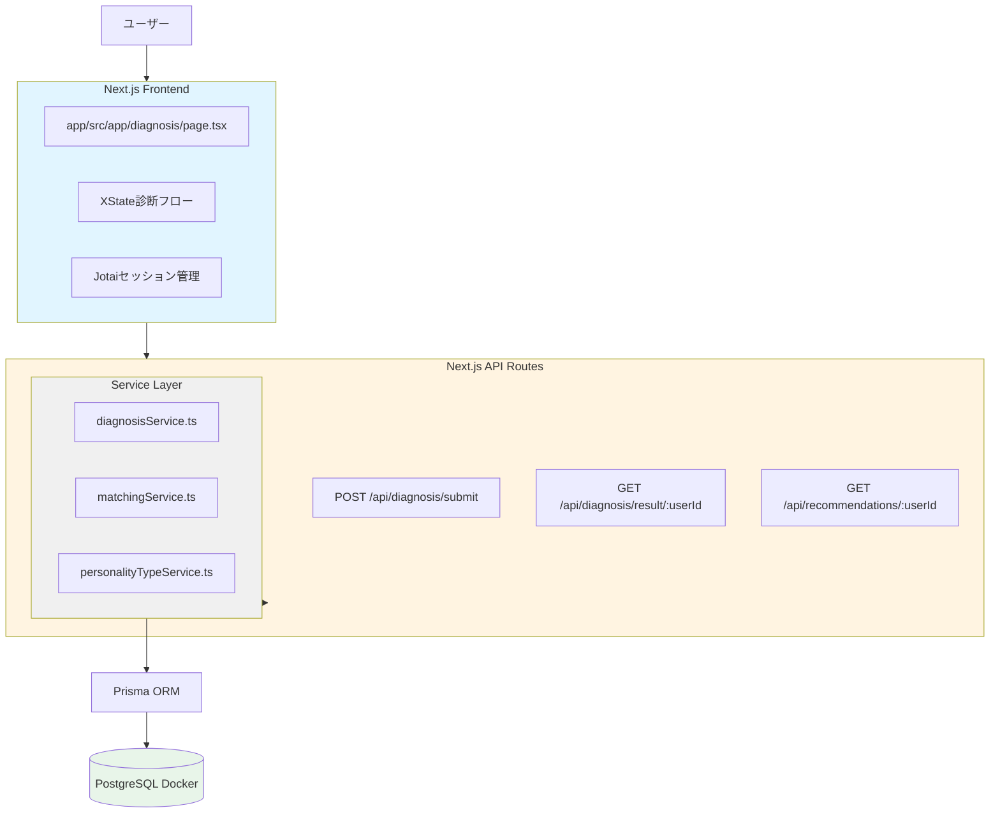
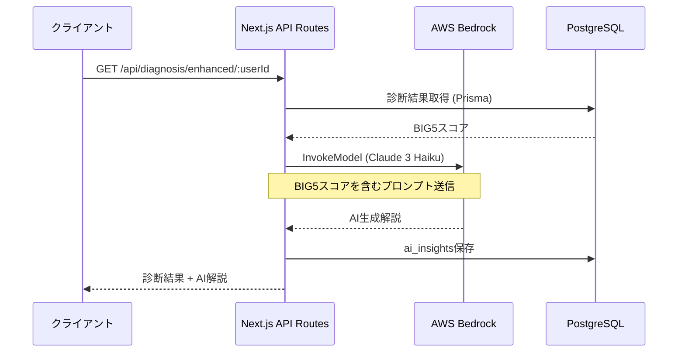
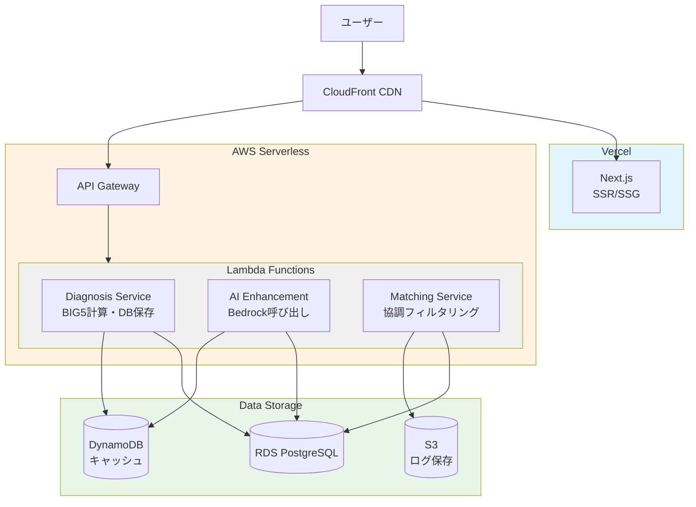
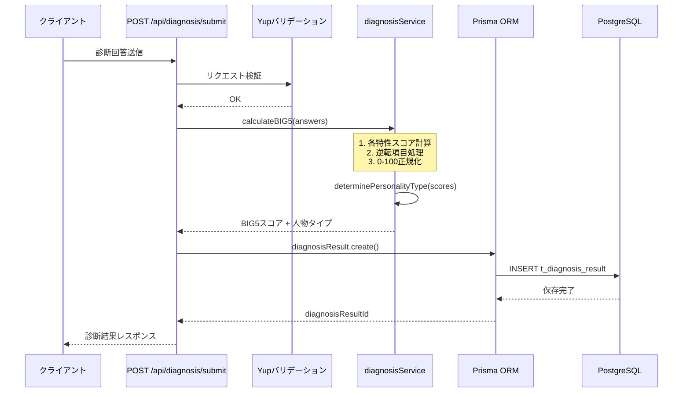
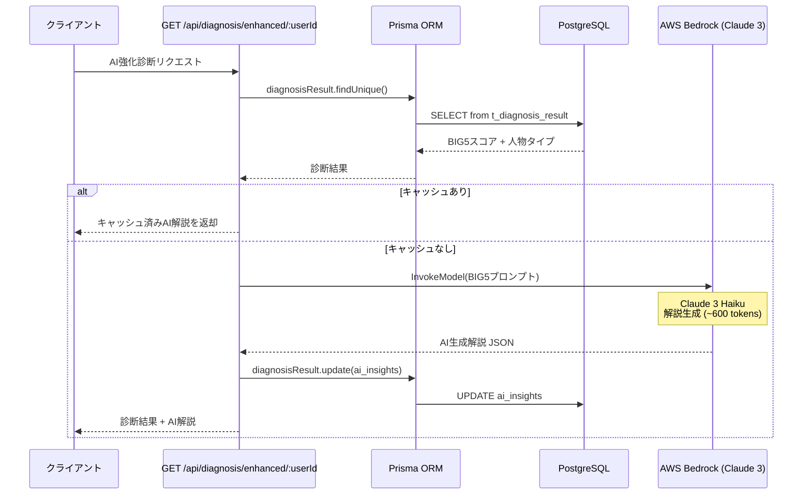
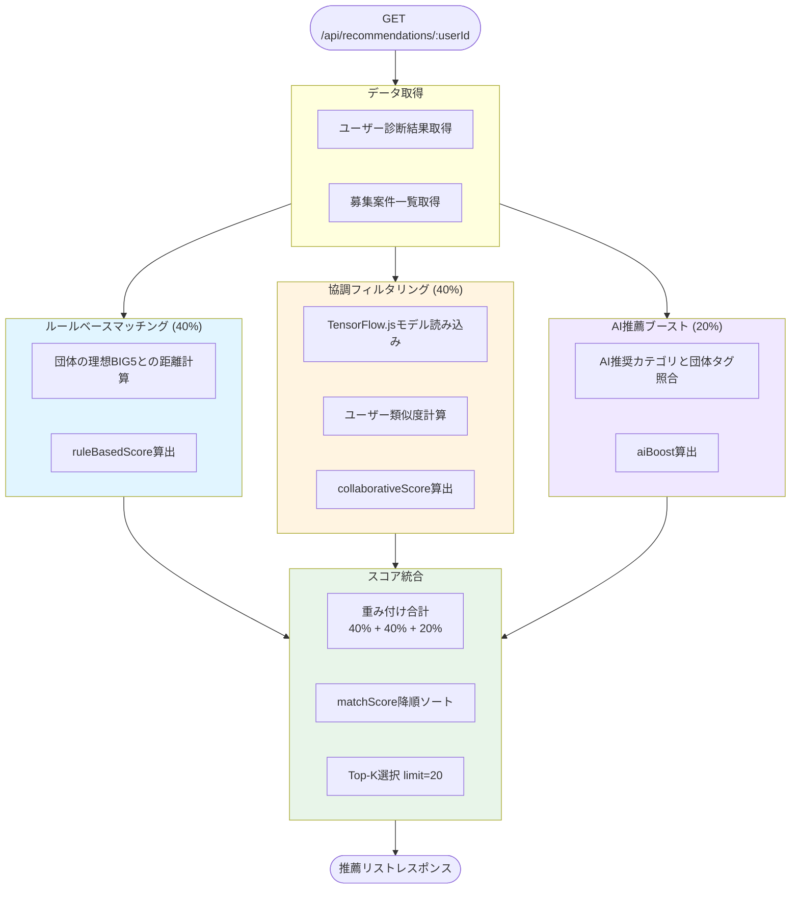
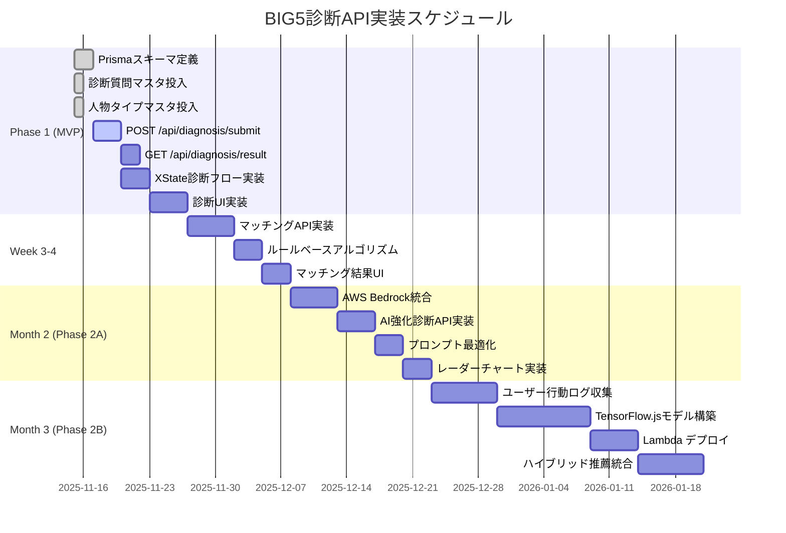

# BIG5性格診断API アーキテクチャ設計書

## 目次
1. [概要](#概要)
2. [アーキテクチャパターン](#アーキテクチャパターン)
3. [API エンドポイント設計](#apiエンドポイント設計)
4. [ディレクトリ構成](#ディレクトリ構成)
5. [AWS構成とコスト](#aws構成とコスト)
6. [実装ロードマップ](#実装ロードマップ)

---

## 概要

BIG5性格診断に基づくボランティアマッチングAPIの段階的実装戦略。

### 技術スタック
- **フロントエンド**: Next.js 16 (App Router) + React 19 + TypeScript
- **状態管理**: XState (診断フロー) + Jotai (グローバル状態)
- **バックエンド**: Next.js API Routes → 段階的にAWS Lambda化
- **DB**: PostgreSQL 15+ (Prisma ORM)
- **AI**: AWS Bedrock (Claude 3 Haiku)
- **インフラ**: Docker Compose (開発) → AWS (本番)

---

## アーキテクチャパターン

### Phase 1: MVP（Next.js API Routes）



**利点**:
- ✅ 最速実装（追加インフラ不要）
- ✅ 開発・デプロイがシンプル
- ✅ Vercel無料枠で動作

**制約**:
- ⚠️ 重い処理（協調フィルタリング）には不向き
- ⚠️ スケーリング限界

---

### Phase 2: AWS Bedrock統合



**追加コンポーネント**:
- AWS SDK for JavaScript v3
- AWS Bedrock (ap-northeast-1リージョン)
- 環境変数: `AWS_ACCESS_KEY_ID`, `AWS_SECRET_ACCESS_KEY`

**コスト**: 約¥0.12/診断（600 tokens想定）

---

### Phase 3: マイクロサービス化



---

## API エンドポイント設計

### 1. 診断回答送信

```http
POST /api/diagnosis/submit
Content-Type: application/json

{
  "userId": "uuid",
  "answers": [
    { "questionId": "e1", "value": 4 },
    { "questionId": "a1", "value": 5 },
    ...
  ]
}
```

**レスポンス**:
```json
{
  "diagnosisResultId": "uuid",
  "big5Scores": {
    "extraversion": 75,
    "agreeableness": 82,
    "conscientiousness": 68,
    "neuroticism": 45,
    "openness": 90
  },
  "personalityType": {
    "id": "innovator-leader",
    "name": "イノベーター・リーダータイプ",
    "description": "新しいアイデアを積極的に提案し、チームを牽引する",
    "strengths": ["プロジェクトリーダー", "企画立案"],
    "suitableActivities": ["イベント統括"]
  },
  "closestType": {
    "type": { /* 同上 */ },
    "distance": 12.5
  }
}
```

**処理フロー**:



1. リクエストバリデーション（Yup）
2. 各特性のスコア計算（逆転項目処理）
3. 0-100正規化
4. 人物タイプ判定（`determinePersonalityType`）
5. DB保存（`t_diagnosis_result`）
6. レスポンス返却

---

### 2. 診断結果取得

```http
GET /api/diagnosis/result/:userId
```

**レスポンス**: 上記と同じ

---

### 3. AI強化診断（Phase 2）

```http
GET /api/diagnosis/enhanced/:userId
```

**レスポンス**:
```json
{
  "diagnosisResult": { /* 基本診断結果 */ },
  "aiInsights": {
    "summary": "あなたは創造性と実行力を兼ね備えた革新型のリーダータイプです",
    "recommendations": [
      "地域の環境保全プロジェクトの企画リーダー",
      "子どもたちへのSTEM教育イベントの運営"
    ],
    "tips": "チームメンバーの意見も積極的に取り入れることで、より多様なアイデアが生まれます",
    "strengthsDetail": "高い開放性により新しいアプローチを恐れず..."
  }
}
```

**処理フロー**:



1. DB から診断結果取得
2. AWS Bedrock にプロンプト送信
3. AI 生成結果をパース
4. キャッシュ保存（`ai_insights` カラム）
5. レスポンス返却

---

### 4. マッチング推薦

```http
GET /api/recommendations/:userId?limit=20&method=hybrid
```

**クエリパラメータ**:
- `limit`: 取得件数（デフォルト20）
- `method`: `rule-based` | `collaborative` | `hybrid`

**レスポンス**:
```json
{
  "recommendations": [
    {
      "opportunityId": "uuid",
      "organizationName": "NPO法人グリーンアース",
      "title": "都市部での植樹活動ボランティア募集",
      "matchScore": 87.5,
      "scoreBreakdown": {
        "ruleBasedScore": 85,
        "collaborativeScore": 90,
        "aiBoost": 10
      },
      "tags": ["環境保全", "屋外活動"],
      "location": "渋谷区",
      "startDate": "2025-12-01"
    }
  ],
  "method": "hybrid"
}
```

**処理フロー（hybrid）**:



1. ルールベースマッチング（40%重み）
2. 協調フィルタリング（40%重み、Phase 2〜）
3. AI推薦ブースト（20%重み、Phase 2〜）
4. スコア統合・ソート
5. Top-K 返却

---

## ディレクトリ構成

```
app/
├── src/
│   ├── app/
│   │   ├── api/
│   │   │   ├── diagnosis/
│   │   │   │   ├── submit/
│   │   │   │   │   └── route.ts          # POST診断回答
│   │   │   │   ├── result/
│   │   │   │   │   └── [userId]/
│   │   │   │   │       └── route.ts      # GET診断結果
│   │   │   │   └── enhanced/
│   │   │   │       └── [userId]/
│   │   │   │           └── route.ts      # GET AI強化診断
│   │   │   └── recommendations/
│   │   │       └── [userId]/
│   │   │           └── route.ts          # GETマッチング推薦
│   │   ├── diagnosis/
│   │   │   └── page.tsx                  # 診断UI
│   │   └── layout.tsx
│   ├── services/
│   │   ├── diagnosisService.ts           # BIG5スコア計算
│   │   ├── personalityTypeService.ts     # タイプ判定
│   │   ├── matchingService.ts            # マッチング
│   │   └── ai/
│   │       ├── bedrockService.ts         # Bedrock連携
│   │       └── collaborativeFiltering.ts # 協調フィルタ
│   ├── machines/
│   │   └── diagnosisMachine.ts           # XState状態機械
│   ├── atoms/
│   │   └── diagnosisAtoms.ts             # Jotaiアトム
│   ├── types/
│   │   └── personality.ts                # 型定義
│   └── lib/
│       └── prisma.ts                     # Prismaクライアント
├── prisma/
│   ├── schema.prisma                     # DBスキーマ
│   └── migrations/
└── package.json
```

---

## AWS構成とコスト

### Phase 2 構成

| サービス       | 用途                   | 料金体系                  | 月間コスト（1000診断想定） |
| -------------- | ---------------------- | ------------------------- | -------------------------- |
| **Bedrock**    | Claude 3 Haiku         | $0.00025/1K input tokens  | **¥120**                   |
|                |                        | $0.00125/1K output tokens |                            |
| **Lambda**     | 協調フィルタリング推論 | $0.20/100万リクエスト     | **¥10**                    |
|                |                        | + 実行時間                |                            |
| **DynamoDB**   | 診断結果キャッシュ     | オンデマンド              | **¥50**                    |
| **CloudWatch** | ログ・メトリクス       | 無料枠内                  | **¥0**                     |
| **合計**       |                        |                           | **約¥180/月**              |

### Phase 3 追加コスト

| サービス         | 用途           | 月間コスト（10,000ユーザー想定） |
| ---------------- | -------------- | -------------------------------- |
| **RDS Postgres** | メインDB       | **¥5,000〜**（db.t3.micro）      |
| **API Gateway**  | エンドポイント | **¥300**（100万リクエスト）      |
| **S3**           | ログ保存       | **¥50**                          |
| **合計**         |                | **約¥5,500/月**                  |

---

## 実装ロードマップ



### Week 1-2: MVP基盤構築
- [x] Prismaスキーマ定義（`database-design.md`準拠）
- [x] 診断質問マスタ投入（50問）
- [x] 人物タイプマスタ投入（10タイプ）
- [ ] `POST /api/diagnosis/submit` 実装
- [ ] `GET /api/diagnosis/result/:userId` 実装
- [ ] XState診断フロー実装
- [ ] UI実装（診断画面）

### Week 3-4: マッチング機能
- [ ] `GET /api/recommendations/:userId` 実装
- [ ] ルールベースマッチングアルゴリズム
- [ ] マッチング結果UI

### Month 2: AI強化（Phase 2A）
- [ ] AWS Bedrock統合
- [ ] `GET /api/diagnosis/enhanced/:userId` 実装
- [ ] AI解説生成プロンプト最適化
- [ ] レーダーチャート可視化

### Month 3: 協調フィルタリング（Phase 2B）
- [ ] ユーザー行動ログ収集開始
- [ ] TensorFlow.js モデル構築
- [ ] Lambda デプロイ
- [ ] ハイブリッド推薦システム統合

### Month 4〜: Phase 3 検討
- [ ] マイクロサービス化の必要性評価
- [ ] RDS移行計画
- [ ] API Gateway + Lambda構成設計

---

## セキュリティ考慮事項

### 認証・認可
- OAuth 2.0（Google/LINE）
- JWT トークン管理（Next.js middleware）
- API エンドポイントでのユーザー検証

### データ保護
- PII 暗号化（`m_user.email`）
- Row Level Security（PostgreSQL）
- AI入出力ログのマスキング

### AWS IAM
```json
{
  "Version": "2012-10-17",
  "Statement": [
    {
      "Effect": "Allow",
      "Action": [
        "bedrock:InvokeModel"
      ],
      "Resource": [
        "arn:aws:bedrock:ap-northeast-1::foundation-model/anthropic.claude-3-haiku-20240307-v1:0"
      ]
    }
  ]
}
```

---

## モニタリング・KPI

### 技術KPI
- API レスポンス時間: p95 < 500ms
- Bedrock 呼び出し成功率: > 99.5%
- DB クエリ時間: p95 < 100ms

### ビジネスKPI
- 診断完了率: > 80%
- 応募転換率: > 30%
- 推薦精度（Top-10 hit rate）: > 60%

---

## 参考資料

- [Next.js API Routes](https://nextjs.org/docs/app/building-your-application/routing/route-handlers)
- [AWS Bedrock SDK](https://docs.aws.amazon.com/AWSJavaScriptSDK/v3/latest/client/bedrock-runtime/)
- [Prisma Documentation](https://www.prisma.io/docs)
- [XState Documentation](https://xstate.js.org/)

---

**更新履歴**:
- 2025-11-15: 初版作成
