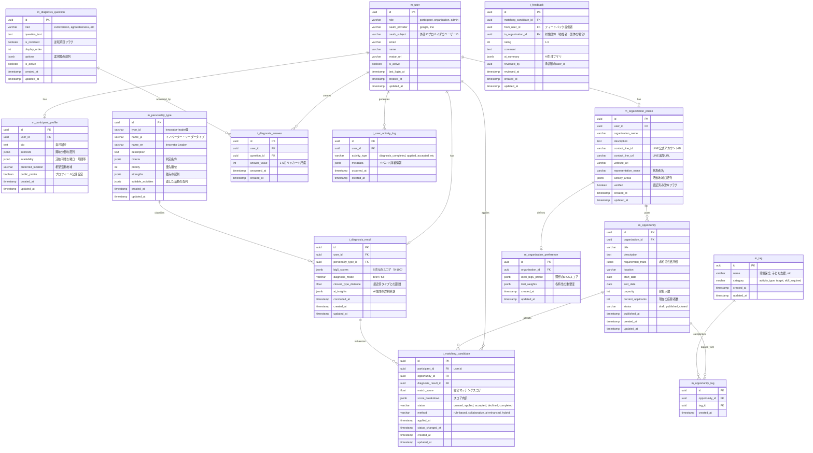
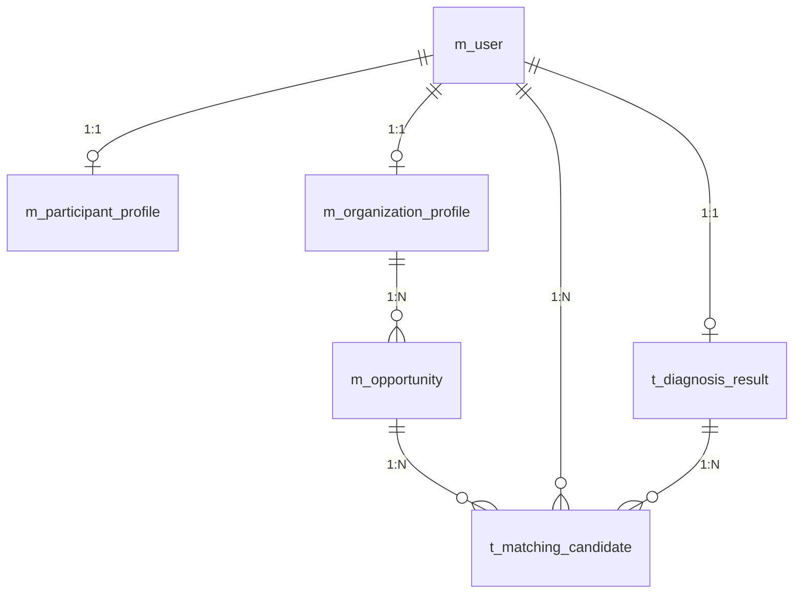

# データベース設計書

## 1. 概要

### 1.1 目的
ボランティアマッチングプラットフォーム「volunty」のデータベース設計書。
性格診断（BIG5）を基盤とした参加者と団体のマッチング機能を実現する。

### 1.2 データベース種別
- **DBMS**: PostgreSQL 15以上
- **理由**: 
  - JSON型サポート（診断結果やメタデータの柔軟な保存）
  - 高度なインデックス機能（マッチングクエリの最適化）
  - トランザクションの堅牢性
  - 拡張性とコミュニティサポート

### 1.3 命名規則
- **テーブル名**: 
  - マスタ系テーブル: `m_` プレフィックス + 単数形、スネークケース（例: `m_user`, `m_personality_type`）
  - トランザクション系テーブル: `t_` プレフィックス + 単数形、スネークケース（例: `t_diagnosis_answer`, `t_matching_candidate`）
- **カラム名**: スネークケース（例: `created_at`, `user_id`）
- **主キー**: `id` (UUID v4)
- **外部キー**: `{参照テーブル名}_id` (例: `user_id`, `organization_id`）※プレフィックスは含めない
- **タイムスタンプ**: `created_at`, `updated_at` を全テーブルに付与

---

## 2. ER図



---

## 3. テーブル詳細定義

### 3.1 m_user（ユーザー）
全利用者の共通アカウント情報。参加者・団体・管理者を統合管理。

| カラム名       | 型           | NULL     | デフォルト        | 説明                                 |
| -------------- | ------------ | -------- | ----------------- | ------------------------------------ |
| id             | UUID         | NOT NULL | gen_random_uuid() | 主キー                               |
| role           | VARCHAR(20)  | NOT NULL | 'participant'     | participant / organization / admin   |
| oauth_provider | VARCHAR(20)  | NOT NULL | -                 | google / line                        |
| oauth_subject  | VARCHAR(255) | NOT NULL | -                 | 外部IDプロバイダのユーザーID         |
| email          | VARCHAR(255) | NULL     | -                 | メールアドレス（プロバイダから取得） |
| name           | VARCHAR(100) | NULL     | -                 | 表示名                               |
| avatar_url     | TEXT         | NULL     | -                 | プロフィール画像URL                  |
| is_active      | BOOLEAN      | NOT NULL | true              | アカウント有効フラグ                 |
| last_login_at  | TIMESTAMP    | NULL     | -                 | 最終ログイン日時                     |
| created_at     | TIMESTAMP    | NOT NULL | CURRENT_TIMESTAMP | 作成日時                             |
| updated_at     | TIMESTAMP    | NOT NULL | CURRENT_TIMESTAMP | 更新日時                             |

**制約:**
- PRIMARY KEY: `id`
- UNIQUE: `(oauth_provider, oauth_subject)`
- CHECK: `role IN ('participant', 'organization', 'admin')`
- INDEX: `idx_user_email` ON `email`
- INDEX: `idx_user_role` ON `role`

---

### 3.2 m_participant_profile（参加者プロフィール）
ボランティア参加者の詳細情報。

| カラム名           | 型           | NULL     | デフォルト        | 説明                                       |
| ------------------ | ------------ | -------- | ----------------- | ------------------------------------------ |
| id                 | UUID         | NOT NULL | gen_random_uuid() | 主キー                                     |
| user_id            | UUID         | NOT NULL | -                 | users.id 外部キー                          |
| bio                | TEXT         | NULL     | -                 | 自己紹介                                   |
| interests          | JSONB        | NULL     | -                 | 興味分野 ["環境保全", "子ども支援"]        |
| diagnosis_mode     | VARCHAR(20)  | NULL     | -                 | 最新診断モード（brief / full）             |
| diagnosis_type     | VARCHAR(100) | NULL     | -                 | 最新診断タイプID                           |
| diagnosis_scores   | JSONB        | NULL     | -                 | 最新BIG5スコア                             |
| availability       | JSONB        | NULL     | -                 | {"weekdays": ["土", "日"], "time": "午前"} |
| preferred_location | VARCHAR(100) | NULL     | -                 | 希望活動地域                               |
| public_profile     | BOOLEAN      | NOT NULL | true              | プロフィール公開設定                       |
| created_at         | TIMESTAMP    | NOT NULL | CURRENT_TIMESTAMP | 作成日時                                   |
| updated_at         | TIMESTAMP    | NOT NULL | CURRENT_TIMESTAMP | 更新日時                                   |

**制約:**
- PRIMARY KEY: `id`
- FOREIGN KEY: `user_id` REFERENCES `m_user(id)` ON DELETE CASCADE
- UNIQUE: `user_id`
- INDEX: `idx_participant_location` ON `preferred_location`

---

### 3.3 m_organization_profile（団体プロフィール）
ボランティア募集団体の情報。

| カラム名            | 型           | NULL     | デフォルト        | 説明                   |
| ------------------- | ------------ | -------- | ----------------- | ---------------------- |
| id                  | UUID         | NOT NULL | gen_random_uuid() | 主キー                 |
| user_id             | UUID         | NOT NULL | -                 | users.id 外部キー      |
| organization_name   | VARCHAR(255) | NOT NULL | -                 | 団体名                 |
| description         | TEXT         | NULL     | -                 | 団体説明               |
| contact_line_id     | VARCHAR(100) | NULL     | -                 | LINE公式アカウントID   |
| contact_line_url    | TEXT         | NULL     | -                 | LINE追加URL            |
| website_url         | TEXT         | NULL     | -                 | ウェブサイトURL        |
| representative_name | VARCHAR(100) | NULL     | -                 | 代表者名               |
| activity_areas      | JSONB        | NULL     | -                 | ["渋谷区", "世田谷区"] |
| verified            | BOOLEAN      | NOT NULL | false             | 認証済み団体フラグ     |
| created_at          | TIMESTAMP    | NOT NULL | CURRENT_TIMESTAMP | 作成日時               |
| updated_at          | TIMESTAMP    | NOT NULL | CURRENT_TIMESTAMP | 更新日時               |

**制約:**
- PRIMARY KEY: `id`
- FOREIGN KEY: `user_id` REFERENCES `m_user(id)` ON DELETE CASCADE
- UNIQUE: `user_id`
- INDEX: `idx_organization_verified` ON `verified`
- INDEX: `idx_organization_name` ON `organization_name`

---

### 3.4 m_diagnosis_question（診断質問）
BIG5性格診断の質問マスタ。

| カラム名             | 型          | NULL     | デフォルト        | 説明                                          |
| -------------------- | ----------- | -------- | ----------------- | --------------------------------------------- |
| id                   | UUID        | NOT NULL | gen_random_uuid() | 主キー                                        |
| trait                | VARCHAR(30) | NOT NULL | -                 | extraversion, agreeableness, etc              |
| question_text        | TEXT        | NOT NULL | -                 | 質問文                                        |
| diagnosis_mode       | VARCHAR(20) | NOT NULL | -                 | brief / full                                  |
| question_set_version | VARCHAR(20) | NOT NULL | v1                | 質問セットのバージョン                        |
| is_reversed          | BOOLEAN     | NOT NULL | false             | 逆転項目フラグ                                |
| display_order        | INT         | NOT NULL | -                 | 表示順序                                      |
| options              | JSONB       | NOT NULL | -                 | [{"label": "全く当てはまらない", "value": 1}] |
| is_active            | BOOLEAN     | NOT NULL | true              | 有効フラグ                                    |
| created_at           | TIMESTAMP   | NOT NULL | CURRENT_TIMESTAMP | 作成日時                                      |
| updated_at           | TIMESTAMP   | NOT NULL | CURRENT_TIMESTAMP | 更新日時                                      |

**制約:**
- PRIMARY KEY: `id`
- CHECK: `diagnosis_mode IN ('brief', 'full')`
- CHECK: `trait IN ('extraversion', 'agreeableness', 'conscientiousness', 'neuroticism', 'openness')`
- INDEX: `idx_question_trait_order` ON `(diagnosis_mode, question_set_version, trait, display_order)`
- INDEX: `idx_question_active` ON `is_active`

---

### 3.5 t_diagnosis_answer（診断回答）
参加者の診断質問への回答記録。

| カラム名     | 型        | NULL     | デフォルト        | 説明                            |
| ------------ | --------- | -------- | ----------------- | ------------------------------- |
| id           | UUID      | NOT NULL | gen_random_uuid() | 主キー                          |
| user_id      | UUID      | NOT NULL | -                 | users.id 外部キー               |
| question_id  | UUID      | NOT NULL | -                 | diagnosis_questions.id 外部キー |
| answer_value | INT       | NOT NULL | -                 | 1-5のリッカート尺度             |
| answered_at  | TIMESTAMP | NOT NULL | CURRENT_TIMESTAMP | 回答日時                        |
| created_at   | TIMESTAMP | NOT NULL | CURRENT_TIMESTAMP | 作成日時                        |

**制約:**
- PRIMARY KEY: `id`
- FOREIGN KEY: `user_id` REFERENCES `m_user(id)` ON DELETE CASCADE
- FOREIGN KEY: `question_id` REFERENCES `m_diagnosis_question(id)` ON DELETE CASCADE
- CHECK: `answer_value BETWEEN 1 AND 5`
- INDEX: `idx_answer_user` ON `user_id`
- INDEX: `idx_answer_question` ON `question_id`

---

### 3.6 m_personality_type（人物タイプマスタ）
BIG5から判定される10人物タイプの定義。

| カラム名            | 型           | NULL     | デフォルト        | 説明                                   |
| ------------------- | ------------ | -------- | ----------------- | -------------------------------------- |
| id                  | UUID         | NOT NULL | gen_random_uuid() | 主キー                                 |
| type_id             | VARCHAR(50)  | NOT NULL | -                 | innovator-leader等                     |
| name_ja             | VARCHAR(100) | NOT NULL | -                 | イノベーター・リーダータイプ           |
| name_en             | VARCHAR(100) | NOT NULL | -                 | Innovator Leader                       |
| description         | TEXT         | NULL     | -                 | タイプの説明                           |
| criteria            | JSONB        | NOT NULL | -                 | {"extraversion": {"min": 75}, ...}     |
| priority            | INT          | NOT NULL | -                 | 優先順位                               |
| strengths           | JSONB        | NULL     | -                 | ["プロジェクトリーダー", "企画立案"]   |
| suitable_activities | JSONB        | NULL     | -                 | ["イベント統括", "新規アプローチ開発"] |
| created_at          | TIMESTAMP    | NOT NULL | CURRENT_TIMESTAMP | 作成日時                               |
| updated_at          | TIMESTAMP    | NOT NULL | CURRENT_TIMESTAMP | 更新日時                               |

**制約:**
- PRIMARY KEY: `id`
- UNIQUE: `type_id`
- INDEX: `idx_personality_priority` ON `priority`

---

### 3.7 t_diagnosis_result（診断結果）
参加者のBIG5診断結果と判定された人物タイプ。

| カラム名              | 型          | NULL     | デフォルト        | 説明                                           |
| --------------------- | ----------- | -------- | ----------------- | ---------------------------------------------- |
| id                    | UUID        | NOT NULL | gen_random_uuid() | 主キー                                         |
| user_id               | UUID        | NOT NULL | -                 | users.id 外部キー                              |
| personality_type_id   | UUID        | NULL     | -                 | personality_types.id 外部キー                  |
| big5_scores           | JSONB       | NOT NULL | -                 | {"extraversion": 85, "agreeableness": 70, ...} |
| diagnosis_mode        | VARCHAR(20) | NOT NULL | brief             | 診断モード（brief / full）                     |
| closest_type_distance | FLOAT       | NULL     | -                 | 最近傍タイプとのユークリッド距離               |
| ai_insights           | JSONB       | NULL     | -                 | AI生成の診断解説                               |
| concluded_at          | TIMESTAMP   | NOT NULL | CURRENT_TIMESTAMP | 診断完了日時                                   |
| created_at            | TIMESTAMP   | NOT NULL | CURRENT_TIMESTAMP | 作成日時                                       |
| updated_at            | TIMESTAMP   | NOT NULL | CURRENT_TIMESTAMP | 更新日時                                       |

**制約:**
- PRIMARY KEY: `id`
- FOREIGN KEY: `user_id` REFERENCES `m_user(id)` ON DELETE CASCADE
- FOREIGN KEY: `personality_type_id` REFERENCES `m_personality_type(id)` ON DELETE SET NULL
- CHECK: `diagnosis_mode IN ('brief', 'full')`
- INDEX: `idx_result_user` ON `user_id`
- INDEX: `idx_result_type` ON `personality_type_id`
- INDEX: `idx_result_concluded` ON `concluded_at`

---

### 3.8 m_opportunity（募集案件）
団体が投稿するボランティア募集情報。

| カラム名           | 型           | NULL     | デフォルト        | 説明                              |
| ------------------ | ------------ | -------- | ----------------- | --------------------------------- |
| id                 | UUID         | NOT NULL | gen_random_uuid() | 主キー                            |
| organization_id    | UUID         | NOT NULL | -                 | organization_profiles.id 外部キー |
| title              | VARCHAR(255) | NOT NULL | -                 | 募集タイトル                      |
| description        | TEXT         | NULL     | -                 | 詳細説明                          |
| requirement_traits | JSONB        | NULL     | -                 | 求める性格特性                    |
| location           | VARCHAR(255) | NULL     | -                 | 活動場所                          |
| start_date         | DATE         | NULL     | -                 | 開始日                            |
| end_date           | DATE         | NULL     | -                 | 終了日                            |
| capacity           | INT          | NULL     | -                 | 募集人数                          |
| current_applicants | INT          | NOT NULL | 0                 | 現在の応募者数                    |
| status             | VARCHAR(20)  | NOT NULL | 'draft'           | draft, published, closed          |
| published_at       | TIMESTAMP    | NULL     | -                 | 公開日時                          |
| created_at         | TIMESTAMP    | NOT NULL | CURRENT_TIMESTAMP | 作成日時                          |
| updated_at         | TIMESTAMP    | NOT NULL | CURRENT_TIMESTAMP | 更新日時                          |

**制約:**
- PRIMARY KEY: `id`
- FOREIGN KEY: `organization_id` REFERENCES `m_organization_profile(id)` ON DELETE CASCADE
- CHECK: `status IN ('draft', 'published', 'closed')`
- CHECK: `current_applicants >= 0`
- CHECK: `capacity IS NULL OR capacity > 0`
- INDEX: `idx_opportunity_status` ON `status`
- INDEX: `idx_opportunity_published` ON `published_at`
- INDEX: `idx_opportunity_organization` ON `organization_id`

---

### 3.9 m_tag（タグマスタ）
募集案件のカテゴリ分類用タグ。

| カラム名   | 型          | NULL     | デフォルト        | 説明                                  |
| ---------- | ----------- | -------- | ----------------- | ------------------------------------- |
| id         | UUID        | NOT NULL | gen_random_uuid() | 主キー                                |
| name       | VARCHAR(50) | NOT NULL | -                 | 環境保全, 子ども支援, etc             |
| category   | VARCHAR(30) | NOT NULL | -                 | activity_type, target, skill_required |
| created_at | TIMESTAMP   | NOT NULL | CURRENT_TIMESTAMP | 作成日時                              |
| updated_at | TIMESTAMP   | NOT NULL | CURRENT_TIMESTAMP | 更新日時                              |

**制約:**
- PRIMARY KEY: `id`
- UNIQUE: `name`
- CHECK: `category IN ('activity_type', 'target', 'skill_required')`
- INDEX: `idx_tag_category` ON `category`

---

### 3.10 m_opportunity_tag（募集案件タグ中間テーブル）
募集案件とタグの多対多関係。

| カラム名       | 型        | NULL     | デフォルト        | 説明                      |
| -------------- | --------- | -------- | ----------------- | ------------------------- |
| id             | UUID      | NOT NULL | gen_random_uuid() | 主キー                    |
| opportunity_id | UUID      | NOT NULL | -                 | opportunities.id 外部キー |
| tag_id         | UUID      | NOT NULL | -                 | tags.id 外部キー          |
| created_at     | TIMESTAMP | NOT NULL | CURRENT_TIMESTAMP | 作成日時                  |

**制約:**
- PRIMARY KEY: `id`
- FOREIGN KEY: `opportunity_id` REFERENCES `m_opportunity(id)` ON DELETE CASCADE
- FOREIGN KEY: `tag_id` REFERENCES `m_tag(id)` ON DELETE CASCADE
- UNIQUE: `(opportunity_id, tag_id)`
- INDEX: `idx_opportunity_tag_opportunity` ON `opportunity_id`
- INDEX: `idx_opportunity_tag_tag` ON `tag_id`

---

### 3.11 m_organization_preference（団体の求める人物像）
団体が定義する理想のBIG5プロフィール。

| カラム名           | 型        | NULL     | デフォルト        | 説明                              |
| ------------------ | --------- | -------- | ----------------- | --------------------------------- |
| id                 | UUID      | NOT NULL | gen_random_uuid() | 主キー                            |
| organization_id    | UUID      | NOT NULL | -                 | organization_profiles.id 外部キー |
| ideal_big5_profile | JSONB     | NOT NULL | -                 | {"extraversion": 80, ...}         |
| trait_weights      | JSONB     | NULL     | -                 | {"extraversion": 1.2, ...}        |
| created_at         | TIMESTAMP | NOT NULL | CURRENT_TIMESTAMP | 作成日時                          |
| updated_at         | TIMESTAMP | NOT NULL | CURRENT_TIMESTAMP | 更新日時                          |

**制約:**
- PRIMARY KEY: `id`
- FOREIGN KEY: `organization_id` REFERENCES `m_organization_profile(id)` ON DELETE CASCADE
- UNIQUE: `organization_id`

---

### 3.12 t_matching_candidate（マッチング候補）
参加者と募集案件のマッチング状態を管理。

| カラム名            | 型          | NULL     | デフォルト        | 説明                                                  |
| ------------------- | ----------- | -------- | ----------------- | ----------------------------------------------------- |
| id                  | UUID        | NOT NULL | gen_random_uuid() | 主キー                                                |
| participant_id      | UUID        | NOT NULL | -                 | users.id 外部キー                                     |
| opportunity_id      | UUID        | NOT NULL | -                 | opportunities.id 外部キー                             |
| diagnosis_result_id | UUID        | NULL     | -                 | diagnosis_results.id 外部キー                         |
| match_score         | FLOAT       | NOT NULL | -                 | 総合マッチングスコア（0-100）                         |
| score_breakdown     | JSONB       | NULL     | -                 | {"ruleBasedScore": 75, "collaborativeScore": 80, ...} |
| status              | VARCHAR(20) | NOT NULL | 'queued'          | queued, applied, accepted, declined, completed        |
| method              | VARCHAR(30) | NOT NULL | 'rule-based'      | rule-based, collaborative, ai-enhanced, hybrid        |
| applied_at          | TIMESTAMP   | NULL     | -                 | 応募日時                                              |
| status_changed_at   | TIMESTAMP   | NOT NULL | CURRENT_TIMESTAMP | ステータス変更日時                                    |
| created_at          | TIMESTAMP   | NOT NULL | CURRENT_TIMESTAMP | 作成日時                                              |
| updated_at          | TIMESTAMP   | NOT NULL | CURRENT_TIMESTAMP | 更新日時                                              |

**制約:**
- PRIMARY KEY: `id`
- FOREIGN KEY: `participant_id` REFERENCES `m_user(id)` ON DELETE CASCADE
- FOREIGN KEY: `opportunity_id` REFERENCES `m_opportunity(id)` ON DELETE CASCADE
- FOREIGN KEY: `diagnosis_result_id` REFERENCES `t_diagnosis_result(id)` ON DELETE SET NULL
- CHECK: `status IN ('queued', 'applied', 'accepted', 'declined', 'completed')`
- CHECK: `method IN ('rule-based', 'collaborative', 'ai-enhanced', 'hybrid')`
- CHECK: `match_score BETWEEN 0 AND 100`
- UNIQUE: `(participant_id, opportunity_id)`
- INDEX: `idx_matching_status` ON `status`
- INDEX: `idx_matching_participant` ON `participant_id`
- INDEX: `idx_matching_opportunity` ON `opportunity_id`
- INDEX: `idx_matching_score` ON `match_score DESC`

---

### 3.12a t_approach（団体から参加者へのアプローチ）
団体が公開プロフィールの参加者に送るスカウトメッセージと、参加者の承諾・辞退状態を管理。
既存の応募フローは `t_matching_candidate` に残し、アプローチは専用テーブルで扱う。

| カラム名               | 型          | NULL     | デフォルト        | 説明                                     |
| ---------------------- | ----------- | -------- | ----------------- | ---------------------------------------- |
| id                     | UUID        | NOT NULL | gen_random_uuid() | 主キー                                   |
| organization_id        | UUID        | NOT NULL | -                 | m_organization_profile.id 外部キー       |
| participant_profile_id | UUID        | NOT NULL | -                 | m_participant_profile.id 外部キー        |
| opportunity_id         | UUID        | NOT NULL | -                 | m_opportunity.id 外部キー                |
| message                | TEXT        | NOT NULL | -                 | 団体から参加者へのアプローチメッセージ   |
| match_score            | FLOAT       | NULL     | -                 | 送信時点の相性スコア                     |
| status                 | VARCHAR(20) | NOT NULL | 'sent'            | sent, accepted, declined                 |
| responded_at           | TIMESTAMP   | NULL     | -                 | 参加者が承諾・辞退した日時               |
| created_at             | TIMESTAMP   | NOT NULL | CURRENT_TIMESTAMP | 作成日時                                 |
| updated_at             | TIMESTAMP   | NOT NULL | CURRENT_TIMESTAMP | 更新日時                                 |

**制約:**
- PRIMARY KEY: `id`
- FOREIGN KEY: `organization_id` REFERENCES `m_organization_profile(id)` ON DELETE CASCADE
- FOREIGN KEY: `participant_profile_id` REFERENCES `m_participant_profile(id)` ON DELETE CASCADE
- FOREIGN KEY: `opportunity_id` REFERENCES `m_opportunity(id)` ON DELETE CASCADE
- UNIQUE: `(organization_id, participant_profile_id, opportunity_id)`
- INDEX: `idx_approach_organization` ON `organization_id`
- INDEX: `idx_approach_participant_profile` ON `participant_profile_id`
- INDEX: `idx_approach_opportunity` ON `opportunity_id`
- INDEX: `idx_approach_status` ON `status`

---

### 3.13 t_user_activity_log（ユーザー行動ログ）
ユーザーの行動履歴を記録（分析・機械学習用）。

| カラム名      | 型          | NULL     | デフォルト        | 説明                                        |
| ------------- | ----------- | -------- | ----------------- | ------------------------------------------- |
| id            | UUID        | NOT NULL | gen_random_uuid() | 主キー                                      |
| user_id       | UUID        | NOT NULL | -                 | users.id 外部キー                           |
| activity_type | VARCHAR(50) | NOT NULL | -                 | diagnosis_completed, applied, accepted, etc |
| metadata      | JSONB       | NULL     | -                 | イベント詳細情報                            |
| occurred_at   | TIMESTAMP   | NOT NULL | CURRENT_TIMESTAMP | 発生日時                                    |
| created_at    | TIMESTAMP   | NOT NULL | CURRENT_TIMESTAMP | 作成日時                                    |

**制約:**
- PRIMARY KEY: `id`
- FOREIGN KEY: `user_id` REFERENCES `m_user(id)` ON DELETE CASCADE
- INDEX: `idx_activity_user` ON `user_id`
- INDEX: `idx_activity_type` ON `activity_type`
- INDEX: `idx_activity_occurred` ON `occurred_at DESC`

---

### 3.14 t_feedback（フィードバック）
参加者と団体間の相互フィードバック（Phase 2以降）。

| カラム名              | 型        | NULL     | デフォルト        | 説明                            |
| --------------------- | --------- | -------- | ----------------- | ------------------------------- |
| id                    | UUID      | NOT NULL | gen_random_uuid() | 主キー                          |
| matching_candidate_id | UUID      | NOT NULL | -                 | matching_candidates.id 外部キー |
| from_user_id          | UUID      | NOT NULL | -                 | フィードバック提供者            |
| to_organization_id    | UUID      | NULL     | -                 | 対象団体（参加者→団体の場合）   |
| rating                | INT       | NOT NULL | -                 | 1-5の満足度                     |
| comment               | TEXT      | NULL     | -                 | フィードバックコメント          |
| ai_summary            | JSONB     | NULL     | -                 | AI生成サマリ                    |
| reviewed_by           | UUID      | NULL     | -                 | 承認者のuser_id                 |
| reviewed_at           | TIMESTAMP | NULL     | -                 | 承認日時                        |
| created_at            | TIMESTAMP | NOT NULL | CURRENT_TIMESTAMP | 作成日時                        |
| updated_at            | TIMESTAMP | NOT NULL | CURRENT_TIMESTAMP | 更新日時                        |

**制約:**
- PRIMARY KEY: `id`
- FOREIGN KEY: `matching_candidate_id` REFERENCES `t_matching_candidate(id)` ON DELETE CASCADE
- FOREIGN KEY: `from_user_id` REFERENCES `m_user(id)` ON DELETE CASCADE
- FOREIGN KEY: `to_organization_id` REFERENCES `m_organization_profile(id)` ON DELETE CASCADE
- FOREIGN KEY: `reviewed_by` REFERENCES `m_user(id)` ON DELETE SET NULL
- CHECK: `rating BETWEEN 1 AND 5`
- INDEX: `idx_feedback_matching` ON `matching_candidate_id`
- INDEX: `idx_feedback_organization` ON `to_organization_id`

---

## 4. マイグレーション戦略

### 4.1 初期セットアップ
```sql
-- UUID拡張を有効化
CREATE EXTENSION IF NOT EXISTS "uuid-ossp";
CREATE EXTENSION IF NOT EXISTS "pgcrypto";

-- updated_atの自動更新トリガー関数
CREATE OR REPLACE FUNCTION update_updated_at_column()
RETURNS TRIGGER AS $$
BEGIN
    NEW.updated_at = CURRENT_TIMESTAMP;
    RETURN NEW;
END;
$$ language 'plpgsql';
```

### 4.2 マイグレーションツール
- **Prisma Migrate** を使用（Next.js エコシステムとの親和性）
- マイグレーションファイルは `prisma/migrations/` に保存
- 本番環境へのデプロイ前に `prisma migrate deploy` で適用

### 4.3 初期データ投入
```sql
-- m_personality_type マスタデータ
INSERT INTO m_personality_type (type_id, name_ja, name_en, criteria, priority, strengths, suitable_activities)
VALUES 
  ('innovator-leader', 'イノベーター・リーダータイプ', 'Innovator Leader', 
   '{"extraversion": {"min": 75}, "openness": {"min": 80}, "conscientiousness": {"min": 70}}'::jsonb,
   1,
   '["プロジェクトリーダー", "企画立案", "新規事業開発"]'::jsonb,
   '["イベント統括", "社会課題の新規アプローチ開発"]'::jsonb),
  -- ... 残り9タイプ
;

-- m_tag マスタデータ
INSERT INTO m_tag (name, category)
VALUES 
  ('環境保全', 'activity_type'),
  ('子ども支援', 'activity_type'),
  ('高齢者支援', 'target'),
  -- ...
;
```

---

## 5. パフォーマンス最適化

### 5.1 インデックス戦略
```sql
-- 複合インデックス（マッチング検索の高速化）
CREATE INDEX idx_matching_status_score 
ON t_matching_candidate(status, match_score DESC);

-- JSONB カラムのインデックス
CREATE INDEX idx_diagnosis_big5_gin 
ON t_diagnosis_result USING GIN (big5_scores);

-- 部分インデックス（有効なレコードのみ）
CREATE INDEX idx_opportunity_active 
ON m_opportunity(status, published_at DESC) 
WHERE status = 'published';
```

### 5.2 パーティショニング検討
- `t_user_activity_log` は月次パーティショニングを検討（データ量増加時）
- `t_diagnosis_answer` も将来的にパーティショニング候補

### 5.3 クエリ最適化例
```sql
-- マッチング候補取得（N+1問題を回避）
SELECT 
  mc.*,
  u.name AS participant_name,
  o.title AS opportunity_title,
  dr.big5_scores
FROM t_matching_candidate mc
JOIN m_user u ON mc.participant_id = u.id
JOIN m_opportunity o ON mc.opportunity_id = o.id
LEFT JOIN t_diagnosis_result dr ON mc.diagnosis_result_id = dr.id
WHERE mc.status = 'applied'
ORDER BY mc.match_score DESC
LIMIT 20;
```

---

## 6. セキュリティ・プライバシー

### 6.1 個人情報保護
- **PII（個人識別情報）の暗号化**: 
  - `m_user.email` は暗号化検討（pgcrypto）
  - `t_feedback.comment` は匿名化処理後にAI分析
- **アクセス制御**: 
  - Row Level Security (RLS) を有効化
  - 参加者は自分のデータのみ閲覧可能

```sql
-- RLS例（m_participant_profile）
ALTER TABLE m_participant_profile ENABLE ROW LEVEL SECURITY;

CREATE POLICY participant_own_data 
ON m_participant_profile 
FOR ALL 
USING (user_id = current_setting('app.current_user_id')::uuid);
```

### 6.2 監査ログ
- `t_user_activity_log` で全ユーザー操作を記録
- 管理者操作は別途 `t_admin_audit_log` テーブルを検討

---

## 7. バックアップ・災害復旧

### 7.1 バックアップ方針
- **自動バックアップ**: 日次フルバックアップ（保持期間: 30日）
- **増分バックアップ**: 6時間ごと
- **PITR（Point-in-Time Recovery）**: 有効化

### 7.2 リストア手順
```bash
# PostgreSQLダンプからのリストア
pg_restore -U postgres -d volunty_prod backup_file.dump

# 特定時刻へのリストア（PITR）
pg_basebackup -U replication_user -D /var/lib/postgresql/backup
```

---

## 8. 今後の拡張予定

### 8.1 Phase 2 追加テーブル候補
- `t_notification`: プッシュ通知管理
- `m_message_template`: LINE/メールテンプレート
- `t_ab_test_variant`: A/Bテスト管理

### 8.2 Phase 3 分析基盤
- `t_big5_trait_evolution`: BIG5スコアの経年変化追跡
- `t_team_composition_analysis`: チーム編成最適化データ

---

## 9. 付録

### 9.1 ER図（簡易版）
主要テーブルの関連のみ抽出した簡易版。



### 9.2 データ容量見積もり
**1年間運用時（想定: 10,000ユーザー、500団体）**

| テーブル             | レコード数 | 容量         |
| -------------------- | ---------- | ------------ |
| m_user               | 10,500     | 2 MB         |
| t_diagnosis_answer   | 525,000    | 50 MB        |
| t_diagnosis_result   | 10,000     | 15 MB        |
| m_opportunity        | 5,000      | 5 MB         |
| t_matching_candidate | 100,000    | 80 MB        |
| t_user_activity_log  | 500,000    | 200 MB       |
| **合計**             | -          | **約350 MB** |

### 9.3 参考資料
- [PostgreSQL公式ドキュメント](https://www.postgresql.org/docs/)
- [Prisma Schema Reference](https://www.prisma.io/docs/reference/api-reference/prisma-schema-reference)
- [BIG5性格診断理論](https://ja.wikipedia.org/wiki/ビッグファイブ_(心理学))

---

**更新履歴**:
- 2025-11-09: 初版作成（BIG5診断基盤、マッチング機能対応）
